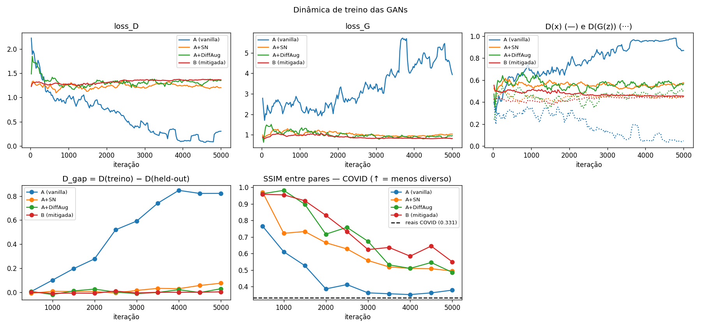
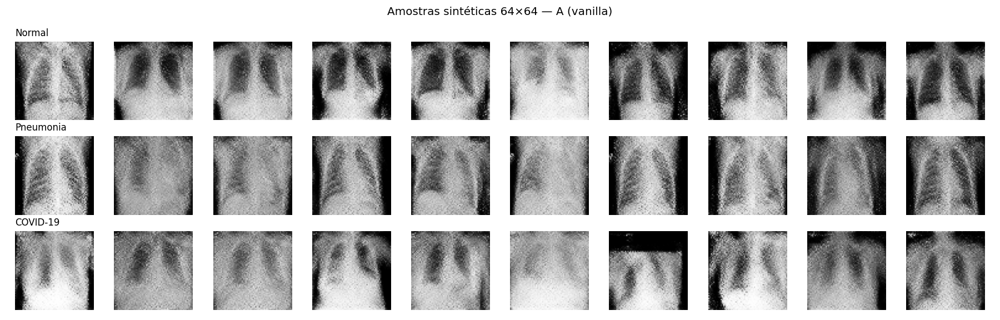
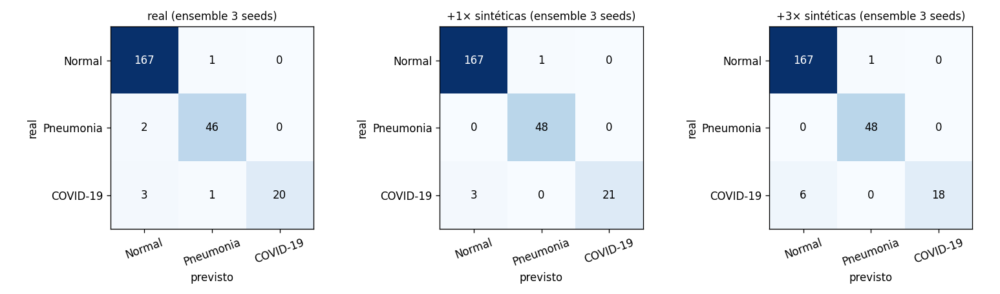
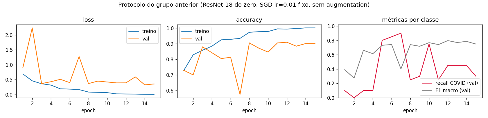
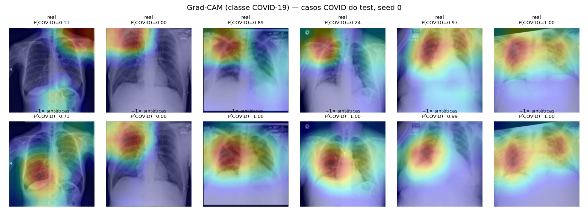

# A4 — Estudo de Caso: Triagem de COVID-19 em Raio-X com Augmentation por GAN

> Por que um sistema de triagem com "93% de accuracy" **ignorava pacientes com COVID-19**, e se uma GAN
> condicional gerando raios-X sintéticos resolve a falta de imagens da classe minoritária. Spoiler: o maior ganho
> vem de consertar o protocolo; a GAN ajuda pouco e pode atrapalhar.

<p>


</p>

Projeto da disciplina **Deep Learning & Computer Vision** (atividade 4.1). Entregável autossuficiente: um único
notebook que roda do início ao fim no **Google Colab (GPU T4)** sem edições. A atividade 4.2 (tráfego urbano) é
entregue só no relatório.

---

## Destaques

- **Diagnóstico com evidência, não só opinião.** 8 problemas técnicos do projeto original, cada um com impacto
  clínico. O classificador trivial "sempre Normal" tem **70%** de accuracy, mais que os 61% reportados.
- **A falha reproduzida.** O protocolo original (ResNet-18 do zero, SGD lr fixo, sem augmentation) dá **90% de
  accuracy e recall COVID de 0,30**: a accuracy esconde 70% dos pacientes COVID perdidos.
- **GAN condicional com diagnóstico de instabilidade.** A cDCGAN vanilla **diverge por overfitting do
  discriminador** (D_gap 0 → 0,82). Spectral norm e DiffAugment eliminam a divergência (D_gap ≈ 0), com ablação
  de cada mitigação.
- **Experimento controlado com vs. sem sintéticas.** 3 braços × 3 seeds, test isolado, IC 95% por bootstrap,
  diferença pareada, checagem de atalho, Grad-CAM e ponto de operação clínico.
- **Resultado honesto.** Com proporção 1:1 as sintéticas reduzem a variância, mas o ganho de recall **não é
  significativo**. Com 3:1 pioram. No limiar de triagem, o modelo só com dados reais é o melhor.

## O que o projeto faz

| Etapa | Entrada | Saída |
|---|---|---|
| **Diagnóstico** | especificação do projeto anterior | 8 problemas × evidência × impacto clínico |
| **Reprodução** | protocolo original | métricas por classe, curvas, matriz de confusão |
| **cGAN** | 720 raios-X de treino (3 classes), 64×64 | gerador condicional + 4 runs (vanilla, ablações, mitigada) |
| **Experimento** | treino real ± 72 / 216 COVID sintéticas | recall COVID, F1 macro, IC 95%, Grad-CAM, limiar clínico |
| **Plano** | todos os resultados | plano integrado + critério de adoção clínica |

Pipeline: **sorteio 840/240/120 → split estratificado 60/20/20 → reprodução do baseline → cGAN (4 configs) → KID /
diversidade / memorização → escolha do gerador → ResNet-18 pré-treinada × 3 braços × 3 seeds → avaliação no test**.

## Dataset

**COVID-19 Radiography Database** (Chowdhury et al., 2020; Rahman et al., 2021). Fonte: Kaggle
[`tawsifurrahman/covid19-radiography-database`](https://www.kaggle.com/datasets/tawsifurrahman/covid19-radiography-database).
PNG 299×299 em escala de cinza, pastas `Normal`, `Viral Pneumonia`, `COVID` (e `Lung_Opacity`, não usada).

Para reproduzir o cenário do enunciado, o notebook sorteia (seed 42) **exatamente 840 Normal, 240 Pneumonia e 120
COVID-19** e divide em treino/val/test **60/20/20 estratificado**:

| | treino | val | test |
|---|---|---|---|
| Normal | 504 | 168 | 168 |
| Pneumonia | 144 | 48 | 48 |
| COVID-19 | 72 | 24 | 24 |

Download via `kagglehub`, sem credenciais. Se falhar, o notebook pede o `kaggle.json`, que **nunca é versionado**
(está no `.gitignore`).

> **Limitação conhecida:** as imagens COVID desta base vêm de fontes diferentes das Normal/Pneumonia. Modelos podem
> aprender "de qual hospital veio" em vez da patologia (DeGrave et al., 2021). O notebook testa isso (§6.1–6.2).

## Por que GAN condicional (e não CycleGAN)

O problema é **escassez** de uma classe, não tradução entre domínios. A cGAN aprende `p(x | classe)` e **compartilha
o aprendizado de anatomia torácica entre as três classes**: as 504 imagens Normal ensinam pulmões, costelas e
mediastino, e o rótulo especializa a patologia. Uma CycleGAN Normal→COVID precisaria de dois pares G/D e, com 72
imagens COVID, tenderia a só "pintar" opacidades sobre anatomia Normal.

Arquitetura DCGAN 64×64 (cabe na T4 e treina em minutos). O loop adversarial é explícito: passo do D com
`detach()`, depois passo do G com loss não saturante. Mitigações testadas: **spectral norm**, **DiffAugment**,
**label smoothing** unilateral e **TTUR**.

## Estrutura

```
A4_estudo_caso_raio_x/
├── A4_estudo_caso_raio_x.ipynb   # ENTREGÁVEL — roda sozinho no Colab T4 (salvo já executado)
├── figures/                       # figuras geradas pelo notebook + results.json (todas as métricas)
├── data/                          # dataset (gitignored)
├── requirements.txt
├── README.md
└── LICENSE
```

## Setup

```bash
python -m venv venv
source venv/Scripts/activate      # Windows Git Bash;  Linux/Mac: source venv/bin/activate
pip install -r requirements.txt
```

## Rodar

**Colab (recomendado, GPU T4).** Abrir `A4_estudo_caso_raio_x.ipynb`, selecionar runtime **T4**, executar todas as
células. O dataset é baixado via `kagglehub`. A última célula compacta `figures/` + `results.json` e baixa o zip.

| Recurso | Medido (Colab T4) |
|---|---|
| Tempo total | **~36 min** (4 GANs ~25 min · 9 treinos do classificador ~9 min) |
| VRAM (pico) | ~4,9 GB |
| RAM | ~3,6 GB |
| Disco | ~1,5 GB |

**Local.** Com o dataset em `data/`, executar o notebook a partir desta pasta. Em CPU, as 4 GANs × 5.000 iterações
são lentas: reduzir `GAN_ITERS` para testar o fluxo.

## Resultados

**Protocolo original vs. corrigido (recall da classe COVID-19):**

| Modelo | Recall COVID | F1 macro | Accuracy |
|---|---|---|---|
| Protocolo original reproduzido (validação) | **0,30** | 0,749 | 0,900 |
| ResNet-18 pré-treinada, só reais (test, 3 seeds) | 0,792 ± 0,110 | 0,934 ± 0,024 | 0,964 ± 0,009 |
| + 72 COVID sintéticas (1:1) | **0,847 ± 0,024** | **0,956 ± 0,003** | 0,974 ± 0,002 |
| + 216 COVID sintéticas (3:1) | 0,750 ± 0,042 | 0,940 ± 0,015 | 0,971 ± 0,008 |

- **Δ recall (1:1 vs. real), ensemble das seeds:** +0,041, IC 95% [−0,100; +0,185]. Não é significativo com 24
  positivos no test.
- **No limiar de triagem** (recall ≥ 0,95 fixado na validação): todos os braços dão sensibilidade 0,958 no test.
  A especificidade é **0,949 só com reais** vs. 0,866 / 0,847 com sintéticas.

**GAN: instabilidade e mitigação**

| Run | KID ×10³ ↓ | SSIM entre pares ↓ | D_gap final |
|---|---|---|---|
| A (vanilla) | 200 | 0,39 | **0,82** (D memorizou o treino) |
| A + spectral norm | 243 | 0,48 | 0,08 |
| A + DiffAugment | 230 | 0,50 | 0,03 |
| B (SN + DiffAug + label smoothing + TTUR) | 242 | 0,58 | **0,004** |
| referência: reais (val) | ≈ 0 | 0,34 | — |

A mitigação elimina a divergência, mas converge mais devagar: com 5.000 iterações a B ainda está subtreinada.

| Dinâmica de treino das GANs | Amostras sintéticas |
|---|---|
|  |  |

| Matrizes de confusão (test, ensemble 3 seeds) |
|---|
|  |

| Baseline reproduzido | Grad-CAM (classe COVID) |
|---|---|
|  |  |

## Status (checklist da rubrica)

- [x] ≥5 problemas técnicos do projeto de raio-X, cada um com impacto clínico (**8**, com evidência numérica — §2)
- [x] Reprodução do protocolo original confirmando a falha (§3)
- [x] GAN condicional (cDCGAN) para raio-X com training loop adversarial correto, compatível com T4 (§4)
- [x] Diagnóstico de instabilidade (divergência por overfitting do D) + mitigações com evidência e ablação (§5)
- [x] Experimento: recall COVID-19 **com vs. sem** sintéticas, 3 seeds, IC 95% por bootstrap (§6)
- [x] Plano de melhoria integrado: modelo, métrica, augmentation sintética e critério de adoção clínica (§7)
- [ ] (Relatório) A4.2 tráfego: ≥4 problemas + riscos de transfer learning ImageNet → fluxo de tráfego

## Uso de IA

Desenvolvido com apoio de **Claude (Anthropic) via Claude Code**, conforme a política "Sinal Verde" da disciplina:
estruturação do projeto, implementação de apoio (cGAN, DiffAugment, KID, Grad-CAM, protocolo experimental), revisão
de código e redação de apoio das análises. Todo o código foi executado, revisado e validado pelo autor. As análises
foram verificadas contra os resultados reais.

## Referências

- Nour, M. & Tariq, U. (2023). *Scientific Reports*. https://www.nature.com/articles/s41598-023-37743-4
- Chowdhury, M. E. H. et al. (2020). Can AI help in screening viral and COVID-19 pneumonia? *IEEE Access*.
- Rahman, T. et al. (2021). *Computers in Biology and Medicine* — COVID-19 Radiography Database.
- DeGrave, A. J., Janizek, J. D. & Lee, S.-I. (2021). AI for radiographic COVID-19 detection selects shortcuts over signal. *Nature Machine Intelligence*.
- Roberts, M. et al. (2021). Common pitfalls and recommendations for using machine learning to detect and prognosticate for COVID-19 using chest radiographs and CT scans. *Nature Machine Intelligence*.
- Radford, A. et al. (2016). DCGAN. *ICLR*. · Mirza, M. & Osindero, S. (2014). Conditional GAN.
- Miyato, T. et al. (2018). Spectral Normalization. *ICLR*. · Zhao, S. et al. (2020). DiffAugment. *NeurIPS*.
- Heusel, M. et al. (2017). TTUR. *NeurIPS*. · Karras, T. et al. (2020). ADA. *NeurIPS*.
- Bińkowski, M. et al. (2018). KID. *ICLR*. · Selvaraju, R. R. et al. (2017). Grad-CAM. *ICCV*.

## Licença

MIT — ver [`LICENSE`](LICENSE).
